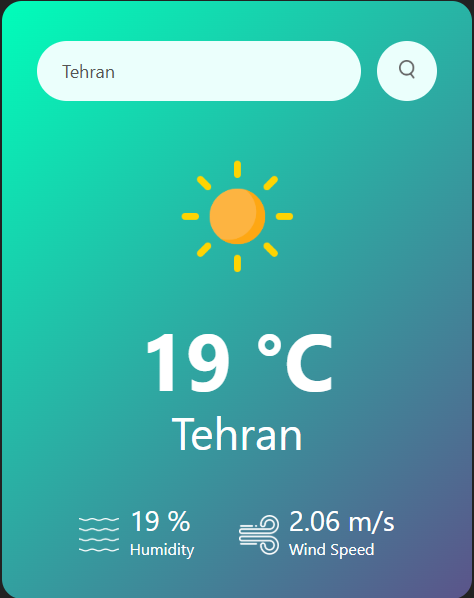

# weatherAppJS
Weather App is a simple yet elegant application that provides real-time weather information for any location around the world.
It demonstrates clean code architecture, RESTful API integration, and user-friendly design principles — ideal as a portfolio project or learning reference.
just enter the city name in search box 

## 🚀 Features
- 🌍 **Search by City Name** – Quickly get weather data for any location. 
- ☀️ **Current Weather Details** – View temperature, humidity, wind speed, and description. 
- 🧭 **Real-Time API Data** – Integrated with **[OpenWeatherMap API](https://openweathermap.org/api)**. 
- 💻 **Responsive UI** – Works smoothly on both mobile and desktop views. 
- ⚙️ **Error Handling** – Graceful failure for invalid city names or network issues. 
## 🧩 Tech Stack
Frontend: HTML5, CSS3, JavaScript 
API: OpenWeatherMap REST API 
## 💡 How to Run Locally
Extract the Weather App.rar file.\
Open the project folder in your code editor.\
Run a local server (via VS Code Live Server).\
Launch the app in your browser to explore live weather updates.\
## 📸 Preview

## 🧠 Learning Highlights
This app demonstrates:
- Working with asynchronous JavaScript (Promises / async-await)
- Consuming JSON APIs in the browser
- Clean UI and minimal design philosophy
- Modular architecture in small JS projects

## 👨‍💻 Author
Created by AminTavakoli-99

Open for suggestions, issues, and improvements — feel free to fork or star ⭐ the repository!
